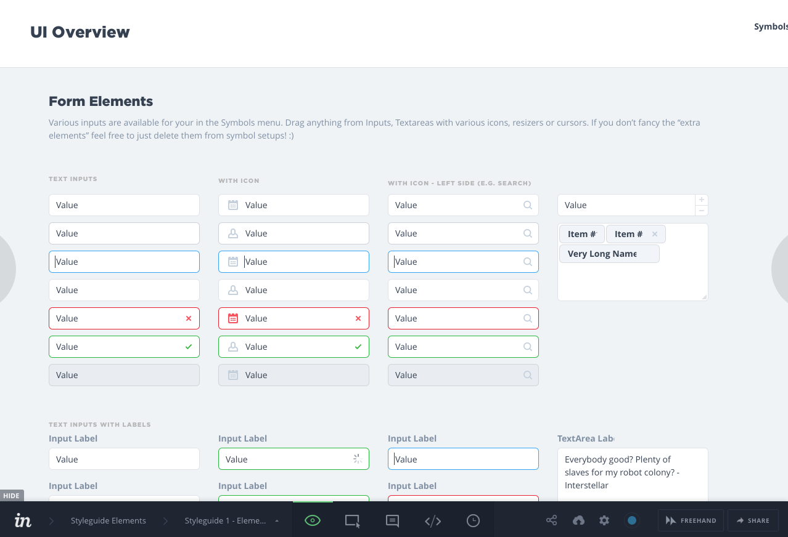
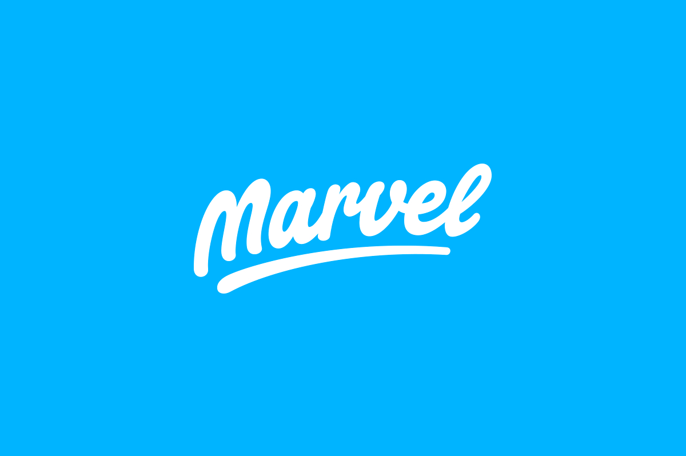
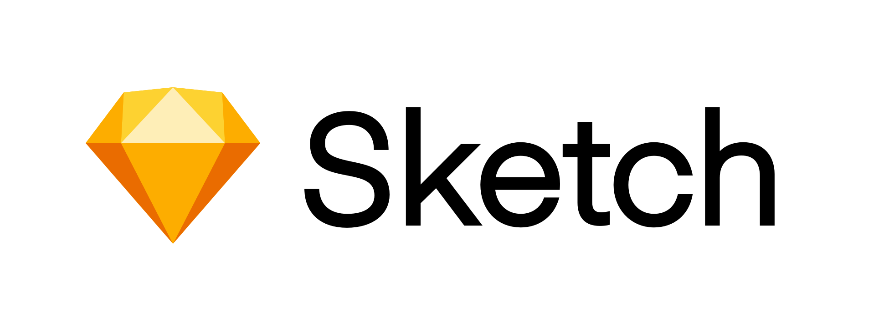
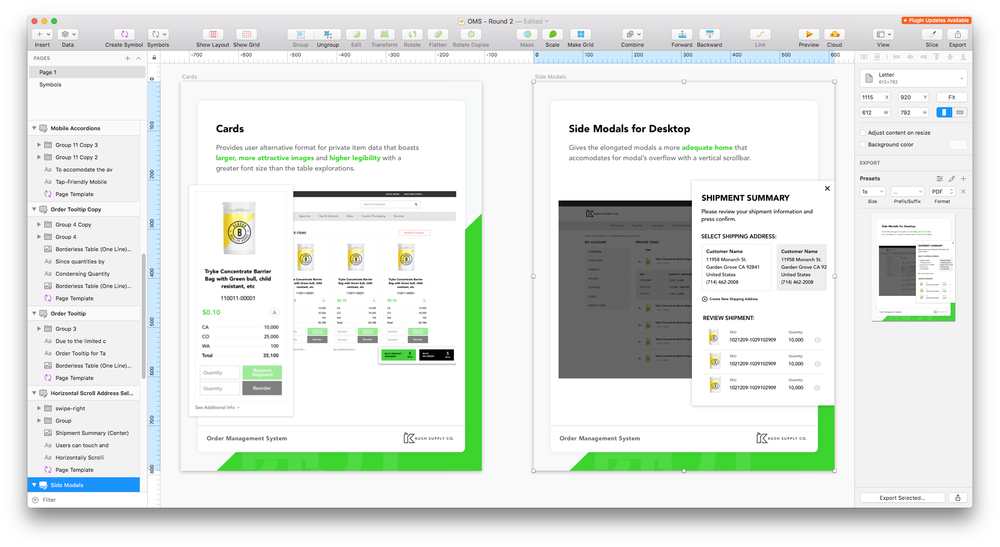
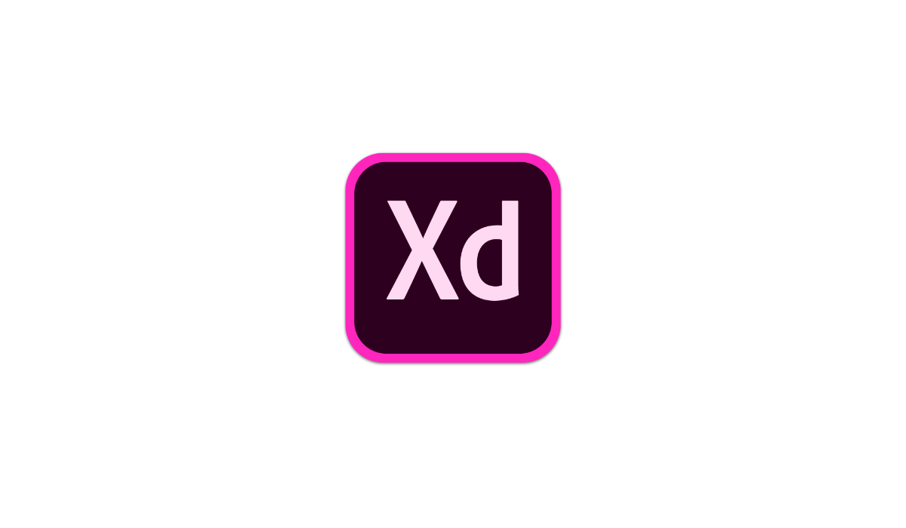
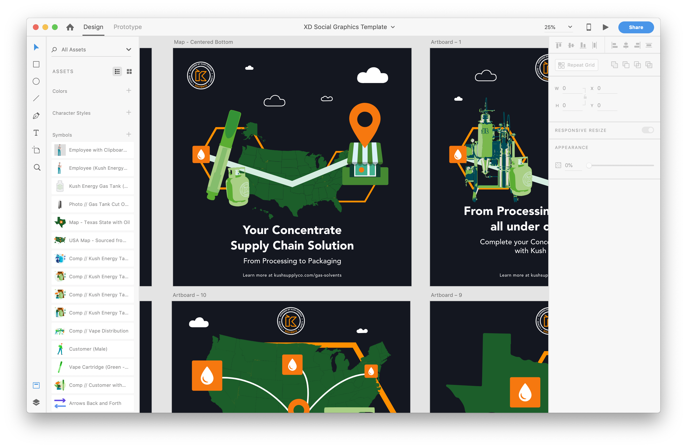

Recently I got to work on a UX/UI project with a new team, and was tasked with selecting a design collaboration tool we'd use to create and collaborate on the mockups and prototypes. The team was comprised of a few different departments that didn't use design tools and 3rd party design studio that used Sketch.

After doing a bit of shopping, I found that **Figma, Invision, Marvel, Adobe XD, and Sketch** each had the features the team desired: Sketch import, cloud-based design, prototyping, and collaboration.

## My Process 🎨

These are the notes I took while exploring each of the apps and putting them standard UI work.

With each app/service, I attempted to **import a Sketch file** that utilized nested symbols. This tested how each app faired importing components, and the quality of the conversion. I also attempted to **create prototypes** to get an idea of the extent of that toolset. Beyond that, I simply explored each app and _poked around_ in the way I normally would on my day-to-day as a designer.

Let the design deliberations begin! 🧐

---

## Figma

This was the best in terms of overall performance, features, and price. It hit the mark with everything we needed, worked on Mac and Windows, did _fairly_ well with operations like importing Sketch files, and the shared component system was fantastic.

Beyond a few minor gripes (and lack of plugins), Figma's browser tool for designing was not nearly as powerful as Sketch in terms of design, but close enough for a majority of basic tasks.

-   Best price for features.
-   No way of exporting to Sketch/XD other than SVG. You import Sketch files with Symbols (that become Figma Components), but then you can't export those "components" without losing all the power of nested components/styles (like changing the color/text of a button dynamically). Once you go Figma, you never go back (for better or worse).
-   Sketch import isn't perfect, requiring me to tweak/fix designs that I spent time meticulously crafting in Sketch (only to have text overflow and change size). Makes the Sketch import less useful, since I feel like I'd rather design directly in Figma to avoid the loss in translation.
-   Sketch import does work amazingly though and imports Symbols as Components (with bugs here or there). The result is an entire component library accessible now in your browser for anyone to prototype without a Mac or Sketch.
-   UI is a little confusing. You can click individual parts of a component, but you can't move them around without reverting the component back to a group/layers. This wouldn't be an issue, since Sketch is the same way, requiring you to edit the "symbol" or component directly (instead of the "instance" of it). The issue is that Figma lets me click on things nested inside the component (which is semi-convenient for changing colors), but gets frustrating when you can't easily tell what's a component or not (particularly being nested 30 layers down and not seeing the parent component layer in the sidebar).
-   Artboards (or "Frames") are annoying. Once you define an artboard, there's no way of resizing it without resizing the child elements responsively. In Sketch and Illustrator, you have the option to disable this. In Figma however, you're forced to wrap you artboard in a new artboard, resize that, then "ungroup" the smaller, nested artboard. The workaround works, but it takes too much time and effort when it's such a frequently used action.

### Features

-   Sketch import (Not 100%)
-   Principle can import Figma prototypes
-   Real time collaboration
-   Prototyping
-   Design system management
-   Live preview on mobile device using Figma Mirror
-   Web interface, desktop apps
-   Reusable Components (Symbols)
-   Text styles / Document Colors

### Pricing 💰

-   Free for 3 projects, 2 editors
-   \$15/editor/mo
-   \$45/editor/mo - Organization level design system

## Invision

High price, but lots of different products and integrations (like Craft for Sketch). Great native app.

-   Highest price, yet most collaborative product (allows for mobile collab via app).
-   Fantastic mobile app experience for sketching ideas and interfaces on the go, better than all other competitors. Became my go-to for pumping out ideas for screens.
-   Sketch import works well, no clunky conversions with heavily nested symbols in a design system.
-   Prototyping in Invision Studio is more powerful than Sketch, but on par with something like Principle.
-   Design system manager creates a library accessible by Studio and Sketch, allowing for syncing and use of symbols across all files -- creating a single source of truth (for design). Pretty nifty, something a lot of designers try to accomplish. The only limitation is unlike Figma, Invision doesn't export to code, so it's not truly a "single source of truth" if you have to also maintain a coded component library.

### Features

-   Sketch import
-   Real time collaboration
-   Prototyping
-   Design system management
-   Web interface, desktop + native apps

### Pricing 💰

-   Free for 1 project
-   \$15/mo - 3 prototypes
-   \$25/mo - Unlimited
-   \$99/mo - 5 team members

## Marvel

More of a fan of their iOS app than the overall service. Browser based design tool isn't as fleshed out as others (Sketch, Figma, etc), and doesn't support symbols/components for individual files. Even [the Marvel blog's article on creating a style guide](https://blog.marvelapp.com/creating-maintaining-marvel-style-guide-sketch/) doesn't show how they integrate a complex Sketch file with their own service.

-   A little pricey for the limited feature set (compared to competitors).
-   Prototyping only for mobile apps.
-   Native app works great, easily my number 2 in the top UX/UI design apps. Makes drawing shapes incredibly easy (something Invision could learn from). The only downside is the limited canvas size, which forces you into a mobile-app resolution. No desktop/tablet UI sketches here.
-   Web based design tool is a plus, allows for designing anywhere.
-   Exports design to code like Figma.
-   Good collaboration tools. Not as fleshed out as Invision, but minimally what you need (point and talk about things in the design -- without annotations).
-   Sketches from mobile app don't work in the web-based design tool, making it impossible to go from wireframes/lofi to hi-fi mockup.
-   No symbols or components for individual projects/designs. Only "shared assets", which act as a global design system. Though it's not exportable or synced to Sketch like the Invision DSM.
-   Sketch plugins allows syncing with Marvel for prototypes/hotspots.

### Pricing 💰

-   Free for 1 user, 1 project
-   \$16/mo - Unlimited
-   \$48/mo - Teams

## Sketch Cloud

It's easy to forget that Sketch in itself is a fully functioning prototyping tool now, complete with a cloud to share designs onto.

### Features

-   Prototyping
-   Collaboration with commenting (basic point and comment, no annotations).
-   Live preview on mobile device using Sketch Mirror
-   Desktop app only for editing
-   Reusable Components (Symbols)
-   Text styles / Document Colors

### Pricing 💰

-   FREE - with purchase of app (see below)
-   \$99 - One time fee for app + yearly updates

## Adobe XD

-   Doesn't have nested symbols (like Figma or Sketch), so when you edit a symbol/component, it effects all others. This also means you can't even scale symbols to different sizes, so you button has to be the exact height and width every single time. The only dynamic part of symbols is text, which is editable. Game breaker for me.
-   No pages. One page for all artboards, and no page for browsing Symbols (only scrollable sidebar).
-   Replacing a symbol replaces all symbols, so if you want to swap an icon, you have to drag it in and position it manually, or replace every single instance of that icon on the page with the new one. Handy if you need to do mass-editing, immobilizing if you need to work on swap a single element.
-   Copy/pasting anything from XD to Illustrator exports as a JPG, instead of SVG elements. You can copy/paste vectors from Illustrator, but can't copy/paste them back unless you export the XD file as SVG and import manually. Semi-understandable once you learn Adobe uses different algorithms for vector objects in every single app, still doesn't make the ecosystem fool-proof. Best case would be to use Adobe's library to import the Illustrator file (like an EPS of an artboard), allowing you to sync changes between both.

### Features

-   Prototyping
-   Embeddable prototypes (for portfolio/sites)
-   Reusable Components (Symbols)
-   Text styles / Document Colors
-   Desktop app only for editing
-   Live preview on mobile device using Adobe XD app
-   Supports Sketch files (complete with Symbols)

### Pricing 💰

-   \$9.99/mo - Individual plan

## But who wins? 🥊

🥇 As always, it depends on what you need. **Figma was honestly the best all-in-one solution out there**, with a cloud-based design and prototyping tool, and the lowest price point with most features. However, the prototyping in Figma is limited, and something like Principle or Invision Studio might more appropriate if your use case involves complex UI animations/transitions.

🥈 **Sketch** comes in a close second, being a complete design and prototyping solution, only inhibited by it's exclusivity to MacOS and limited prototyping tools compared to Principle/Studio.

💩 **Adobe XD** was the most disappointing, where it hit the mark with so many features (great UI, Sketch import, Adobe ecosystem) -- but the fact that symbols weren't that dynamic or even _scalable_ was a game breaker. Making your button a symbol and not being able to make it wider is simply broken. I couldn't bring myself to use it intensively knowing that the workflow would be so inherently restrained by that one missing feature.

### My winner? 🙌

I've landed on using **Sketch** as my primary design tool for most projects and simple prototypes, **Principle** for complex prototypes, and **Figma** if I need to collaborate on a greater level with multiple designers/team members. And for sketching on the go, I can't shake the **Invision iOS app**.

Cheers 🍻
Ryo

---

**References**:

-   [Sketch App](https://www.sketchapp.com/)
-   [Sketch Cloud](https://www.sketchapp.com/docs/sketch-cloud/)
-   [Marvel App](https://marvelapp.com/)
-   [Creating and Maintaining the Marvel Style Guide in Sketch](https://blog.marvelapp.com/creating-maintaining-marvel-style-guide-sketch/)
-   [Invision App](https://invisionapp.com/)
-   [Figma](https://figma.com)
-   [Adobe XD](https:f//www.adobe.com/products/xd.html)
-   [Framer](https://framer.com)
